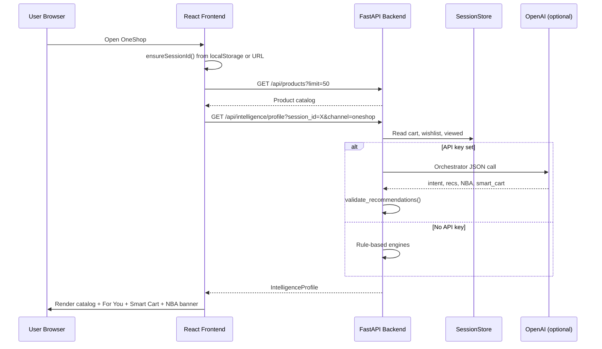

# Omnichannel Consumer AI Engine — Complete Project Guide

> From scratch: High-Level Design → Low-Level Design → APIs → Data Model → Tech Stack → Interview Prep

---

## Table of Contents

1. [What Is This Project?](#1-what-is-this-project)
2. [High-Level Design (HLD)](#2-high-level-design-hld)
3. [Low-Level Design (LLD)](#3-low-level-design-lld)
4. [Data Model & “Tables”](#4-data-model--tables)
5. [API Endpoints Reference](#5-api-endpoints-reference)
6. [Tech Stack & Why We Chose It](#6-tech-stack--why-we-chose-it)
7. [Key Flows (Step by Step)](#7-key-flows-step-by-step)
8. [Interview Questions & Answers](#8-interview-questions--answers)

---

## 1. What Is This Project?

### Problem Being Solved

Digital commerce platforms (like a telecom retailer) have **thousands of products** — phones, plans, tablets, accessories. Customers get lost, abandon carts, and convert poorly.

This project builds an **AI-powered Omnichannel Consumer Intelligence Engine** that:

- Helps customers **discover** the right products
- Guides them through the **purchase funnel** with contextual actions
- Works **consistently across Web (OneShop) and Mobile (OneApp)**
- Uses **Generative AI + rules** so it works even without an OpenAI API key

### What We Built (6 Capabilities)

| Capability | What It Does |
|------------|--------------|
| **ShopAssist V1** | Conversational phone+plan shopping assistant with grounded recommendations and explicit cart confirmation |
| **Personalized Discovery** | “For You” panel based on wishlist, cart, and viewed products |
| **Next Best Action (NBA)** | Contextual banner: compare, add plan, checkout, etc. |
| **Smart Cart & Checkout** | Bundle suggestions, nudges, demo checkout, abandonment recovery |
| **AI Orchestrator** | Single API call returns intent + recs + NBA + smart cart together |
| **Omnichannel** | Same session/cart across web and mobile via `session_id` |

### Demo Channels

- **OneShop Web** → `http://localhost:5173/` (desktop layout)
- **OneApp Mobile** → `http://localhost:5173/app` (mobile shell with bottom nav)

---

## 2. High-Level Design (HLD)

### 2.1 System Architecture

```
┌─────────────────────────────────────────────────────────────────────────┐
│                           CLIENT LAYER                                   │
│  ┌──────────────────────┐          ┌──────────────────────┐             │
│  │   OneShop Web (/)    │          │  OneApp Mobile (/app)│             │
│  │   React + TypeScript │          │   Same codebase      │             │
│  │   Vite dev server    │          │   Different layout   │             │
│  └──────────┬───────────┘          └──────────┬───────────┘             │
│             │         localStorage session_id  │                         │
│             │         BroadcastChannel sync    │                         │
└─────────────┼──────────────────────────────────┼─────────────────────────┘
              │         /api/* (proxied)         │
              ▼                                  ▼
┌─────────────────────────────────────────────────────────────────────────┐
│                        BACKEND LAYER (FastAPI)                           │
│  ┌─────────────┐ ┌─────────────┐ ┌──────────────────┐ ┌───────────────┐ │
│  │   Routers   │ │  Services   │ │   AI Layer       │ │  Data Layer   │ │
│  │  chat       │ │ shopassist  │ │ OpenAI gpt-4o-   │ │ products.json │ │
│  │  products   │ │ orchestrator│ │ mini + embeddings│ │ SessionStore  │ │
│  │ intelligence│ │ recommend   │ │ Rule fallbacks   │ │ (in-memory)   │ │
│  │ omnichannel │ │ smart_cart  │ │                  │ │               │ │
│  └─────────────┘ └─────────────┘ └──────────────────┘ └───────────────┘ │
└─────────────────────────────────────────────────────────────────────────┘
              │
              ▼ (optional)
┌─────────────────────────────────────────────────────────────────────────┐
│                     OpenAI API (when OPENAI_API_KEY set)                 │
│   Chat completions · JSON mode · text-embedding-3-small                  │
└─────────────────────────────────────────────────────────────────────────┘
```

### 2.2 Component Responsibilities

| Layer | Component | Responsibility |
|-------|-----------|----------------|
| **Frontend** | `ShopPage` | Main shopping UI: catalog, cart, recommendations sidebar |
| **Frontend** | `ShopAssistDrawer` | Bounded conversational assistant |
| **Frontend** | `OneApp.tsx` | Mobile shell: Shop · Assist · Sync tabs |
| **Frontend** | `api.ts` | Session management, all HTTP calls, cross-tab sync |
| **Backend** | `main.py` | FastAPI app, CORS, router registration |
| **Backend** | Routers | HTTP boundary — validate input, call services |
| **Backend** | Services | Business logic, AI orchestration, scoring |
| **Backend** | `SessionStore` | Cart, wishlist, views, orders, omnichannel state |
| **Backend** | `ProductCatalog` | Load and search synthetic OneTel catalog |
| **External** | OpenAI | LLM for chat, orchestrator, embeddings (optional) |

### 2.3 Design Principles

1. **AI-first, rules-validated** — LLM proposes; code validates stock, exclusions, and business rules.
2. **Graceful degradation** — Full functionality without API key via rule-based fallbacks.
3. **Session-centric identity** — `session_id` (UUID) ties everything together; optional `customer_id` for cross-device linking.
4. **Commerce-bounded AI** — ShopAssist refuses off-topic requests (poems, billing support, jailbreaks).
5. **Explicit cart mutations** — Chat cannot silently add to cart; user must confirm bundle proposals.

### 2.4 Request Flow (Typical Page Load)



---

## 3. Low-Level Design (LLD)

### 3.1 Backend Folder Structure

```
backend/app/
├── main.py                 # App entry, CORS, health check
├── config.py               # Settings from .env (OPENAI_API_KEY, etc.)
├── data/
│   └── products.json       # Static catalog (~20 synthetic products)
├── models/
│   └── schemas.py          # All Pydantic request/response models
├── routers/
│   ├── chat.py             # POST /api/chat
│   ├── products.py         # GET /api/products, compare, details
│   ├── intelligence.py     # Discovery, NBA, smart cart, checkout, session
│   └── omnichannel.py      # Link customer, context, continue URLs
└── services/
    ├── session_store.py    # In-memory session state (THE "database")
    ├── product_catalog.py  # JSON catalog loader + search/ranking
    ├── shopassist_service.py   # Conversational assistant (phone+plan)
    ├── orchestrator_service.py # Unified AI profile
    ├── recommendation_engine.py
    ├── intent_engine.py        # Signal extraction + product scoring
    ├── catalog_retrieval.py    # RAG-lite: embeddings + keyword fallback
    ├── recommendation_validator.py
    ├── next_best_action_service.py
    ├── smart_cart_service.py
    ├── checkout_service.py
    ├── omnichannel_service.py
    ├── customer_context.py
    ├── conversation_store.py
    └── ai_client.py
```

### 3.2 Frontend Folder Structure

```
frontend/src/
├── main.tsx              # Entry point
├── App.tsx               # OneShop web shell (header + ShopPage)
├── OneApp.tsx            # Mobile app shell
├── api.ts                # All API calls + session/sync utilities
├── pages/
│   └── ShopPage.tsx      # Main shopping experience
├── components/
│   ├── ShopAssistDrawer.tsx    # Chat assistant UI
│   ├── RecommendationsPanel.tsx # "For You" sidebar
│   ├── SmartCartPanel.tsx      # Bundles + nudges
│   ├── NextBestActionBanner.tsx
│   ├── OmnichannelSyncBanner.tsx
│   ├── OmnichannelPanel.tsx    # Sync tab
│   ├── ProductShopCard.tsx
│   ├── ProductDetailModal.tsx
│   ├── CheckoutModal.tsx
│   └── AbandonmentBanner.tsx
└── hooks/
    ├── useCrossTabSync.ts
    └── useCartAbandonment.ts
```

### 3.3 Core Service: SessionStore (In-Memory State)

There is **no PostgreSQL/MySQL** in this prototype. All customer state lives in Python dictionaries inside `SessionStore`:

```python
# Conceptual structure inside SessionStore
_wishlists:      dict[session_id, set[product_id]]
_carts:          dict[session_id, set[product_id]]
_viewed:         dict[session_id, list[product_id]]   # max 20, MRU order
_cart_updated_at: dict[session_id, timestamp]
_abandoned:      dict[session_id, bool]
_recovery_discount: dict[session_id, float]           # 10% on abandonment
_orders:         dict[session_id, list[order_dict]]
_customer_to_session: dict[customer_id, session_id]   # omnichannel linking
_session_to_customer: dict[session_id, customer_id]
_last_channel:   dict[session_id, str]                # oneshop | oneapp
_channels_used:   dict[session_id, set[str]]
```

**Why in-memory?** Hackathon/prototype speed. Production would use Redis (session) + PostgreSQL (orders, customers).

### 3.4 ShopAssist Service (Conversational AI)

**Purpose:** Bounded assistant for phone + plan purchases only.

**State machine per session:**

```
User message
    │
    ├─► Intent guard (unsupported / service / shopping)
    │       └─► Boundary response if not shopping
    │
    ├─► Extract NeedProfile (budget, platform, roaming, lines, etc.)
    │       ├─► Rule-based regex extraction
    │       └─► OpenAI parse (if key set)
    │
    ├─► Enough info? ──No──► CLARIFYING status + follow-up question
    │
    └─► Yes ──► Score catalog ──► RECOMMENDED status
                    │
                    └─► Up to 3 slots: primary_phone, alternative_phone, recommended_plan
                        with reason_codes (WITHIN_DEVICE_BUDGET, CAMERA_MATCH, etc.)
```

**Safety boundaries:**
- Rejects: poems, code, weather, prompt injection
- Redirects: billing, account, network issues → `SERVICE_HANDOFF`
- Cart: only via `PROPOSE_ADD_BUNDLE` action — user confirms in UI

### 3.5 Recommendation Engine (Rules + AI)

**Signal weighting:**

| Signal | Weight | Meaning |
|--------|--------|---------|
| Cart items | 2.0× | Strongest purchase intent |
| Wishlist | 1.0× | Interest |
| Viewed (not in cart/wishlist) | 1.5× | Considering |

**Scoring factors (`intent_engine.score_product`):**
1. Tag overlap with signals
2. Brand match
3. Cross-sell rules (phone → plan/accessory)
4. Price fit vs. inferred budget
5. Category alignment
6. Product rating (tiebreaker)

**AI enhancement path:**
1. Build customer context (cart, wishlist, viewed, chat snippets)
2. RAG-lite: semantic retrieve top 12 products via embeddings
3. LLM picks product IDs from narrowed catalog
4. `validate_recommendations()` ensures IDs exist, in stock, not excluded

**Pipeline labels returned to frontend:**
- `ai_validated` — LLM picked, rules validated
- `semantic_backup` — Embedding search fallback
- `rules` — Pure rule-based scoring

### 3.6 AI Orchestrator (`orchestrator_service.py`)

**Single LLM call** returns JSON with:
- `intent` — categories, brands, tags, funnel stage, summary
- `recommendations` — product IDs + reasons
- `next_actions` — 2–3 conversion steps
- `smart_cart` — nudge, checkout_tip, bundle suggestions

If OpenAI fails or no key → composes profile from individual rule services.

### 3.7 Omnichannel Sync

**Mechanism:**
1. Frontend stores `session_id` in `localStorage` (`oneshop_session_id`)
2. Cross-channel URL: `?session_id=<uuid>` adopted on page load
3. Backend tracks `channel` on each mutation (`oneshop` / `oneapp`)
4. Optional `customer_id` links sessions across devices (merges carts/wishlists)

**Cross-tab sync (same browser):**
- `BroadcastChannel('oneshop-omni-sync')`
- `localStorage` tick key triggers refresh in other tabs

### 3.8 Product Catalog

Static JSON file with categories:

| Category | Examples | Billing |
|----------|----------|---------|
| `phone` | iPhone 15 Pro, Pixel 8 | one_time |
| `tablet` | iPad, Galaxy Tab | one_time |
| `plan` | Unlimited, Family plans | monthly |
| `accessory` | Cases, earbuds | one_time |
| `device` | Hotspots, routers | one_time |

Search supports: query text, category, brand, price range, tags — with token + phrase + price-pattern ranking.

---

## 4. Data Model & “Tables”

### 4.1 Current Implementation (Prototype)

| Storage | Format | Persistence | Contents |
|---------|--------|---------------|----------|
| `products.json` | JSON file | Disk (read-only at startup) | Product catalog |
| `SessionStore` | Python dicts | **In-memory only** (lost on restart) | Sessions, carts, orders |
| `ShopAssistService._states` | Python dicts | In-memory | Chat need profiles, turns |
| `conversation_store` | Python dicts | In-memory | Chat history snippets |
| `_embedding_cache` | Python dict | In-memory | OpenAI product embeddings |
| Browser `localStorage` | Key-value | Client-side | `session_id`, `channel` |

### 4.2 Logical Schema (Production Equivalent)

If this were a real system, these would be the database tables:

#### `products`
| Column | Type | Description |
|--------|------|-------------|
| id | VARCHAR PK | e.g. `iphone-15-pro` |
| name | VARCHAR | Display name |
| category | ENUM | phone, tablet, plan, accessory, device |
| brand | VARCHAR | Apple, Samsung, etc. |
| price | DECIMAL | USD |
| description | TEXT | Marketing copy |
| features | JSONB | Feature bullet list |
| specs | JSONB | Storage, display, battery, etc. |
| image_url | VARCHAR | CDN URL |
| rating | FLOAT | 0–5 |
| in_stock | BOOLEAN | Availability |
| tags | JSONB | premium, camera, ios, 5g, etc. |
| billing_period | ENUM | one_time, monthly |

#### `sessions`
| Column | Type | Description |
|--------|------|-------------|
| session_id | UUID PK | Anonymous browser session |
| customer_id | VARCHAR FK NULL | Linked logged-in customer |
| created_at | TIMESTAMP | |
| last_active_at | TIMESTAMP | |
| last_channel | ENUM | oneshop, oneapp |
| abandoned | BOOLEAN | Cart abandonment flag |
| recovery_discount_pct | FLOAT | e.g. 10.0 |

#### `session_cart_items`
| Column | Type | Description |
|--------|------|-------------|
| session_id | UUID FK | |
| product_id | VARCHAR FK | |
| added_at | TIMESTAMP | |
| channel | ENUM | Which channel added it |

#### `session_wishlist_items`
| Column | Type | Description |
|--------|------|-------------|
| session_id | UUID FK | |
| product_id | VARCHAR FK | |
| added_at | TIMESTAMP | |

#### `session_viewed_products`
| Column | Type | Description |
|--------|------|-------------|
| session_id | UUID FK | |
| product_id | VARCHAR FK | |
| viewed_at | TIMESTAMP | |
| rank | INT | MRU order (max 20) |

#### `orders`
| Column | Type | Description |
|--------|------|-------------|
| order_id | VARCHAR PK | e.g. ORD-A1B2C3D4 |
| session_id | UUID FK | |
| customer_name | VARCHAR | |
| email | VARCHAR | |
| payment_last4 | CHAR(4) | Demo only |
| subtotal | DECIMAL | |
| bundle_savings | DECIMAL | |
| discount | DECIMAL | Abandonment recovery |
| total | DECIMAL | |
| created_at | TIMESTAMP | |

#### `order_items`
| Column | Type | Description |
|--------|------|-------------|
| order_id | VARCHAR FK | |
| product_id | VARCHAR FK | |
| price_at_purchase | DECIMAL | |

#### `customers` (omnichannel)
| Column | Type | Description |
|--------|------|-------------|
| customer_id | VARCHAR PK | e.g. `cust_12345` |
| email | VARCHAR UNIQUE | |
| created_at | TIMESTAMP | |

#### `session_channels` (audit)
| Column | Type | Description |
|--------|------|-------------|
| session_id | UUID FK | |
| channel | ENUM | |
| first_seen_at | TIMESTAMP | |

#### `chat_turns` (ShopAssist)
| Column | Type | Description |
|--------|------|-------------|
| session_id | UUID FK | |
| role | ENUM | user, assistant |
| content | TEXT | |
| need_profile | JSONB | Structured shopping need |
| status | ENUM | clarifying, recommended, etc. |
| created_at | TIMESTAMP | |

### 4.3 Key Pydantic Models (API Contracts)

Defined in `backend/app/models/schemas.py`:

- **Product** — catalog item
- **ChatRequest / ChatResponse** — ShopAssist conversation
- **NeedProfile** — structured shopping need (budget, platform, roaming)
- **CustomerIntent** — extracted from behavioral signals
- **RecommendationItem** — product + score + reason + source
- **IntelligenceProfileResponse** — unified orchestrator output
- **SessionStateResponse** — wishlist, cart, viewed IDs and full products

---

## 5. API Endpoints Reference

Base URL: `http://localhost:8000`  
Interactive docs: `http://localhost:8000/docs`

### 5.1 Health

| Method | Path | Description |
|--------|------|-------------|
| GET | `/api/health` | Service health + LLM mode (`openai` vs `rule-based-fallback`) |
| GET | `/api/chat/health` | Chat-specific AI status |

### 5.2 Products & Catalog

| Method | Path | Query/Body | Response |
|--------|------|------------|----------|
| GET | `/api/products` | `query`, `category`, `min_price`, `max_price`, `brand`, `limit` | `Product[]` |
| GET | `/api/products/{id}` | — | `Product` |
| GET | `/api/products/meta/categories` | — | Category summary + total count |
| POST | `/api/products/compare` | `{ product_ids: string[] }` (2–4 IDs) | `Product[]` |

### 5.3 ShopAssist Chat

| Method | Path | Body | Response |
|--------|------|------|----------|
| POST | `/api/chat` | `ChatRequest`: message, session_id?, channel, page_context? | `ChatResponse` |

**ChatRequest fields:**
```json
{
  "message": "I need a phone under $800 with good camera",
  "session_id": "uuid-optional",
  "channel": "oneshop",
  "page_context": {
    "surface": "catalog",
    "entry_point": "help_me_choose",
    "product_id": null,
    "visible_product_ids": []
  }
}
```

**ChatResponse statuses:** `clarifying`, `recommended`, `no_match`, `unsupported`, `service_handoff`, `error`

### 5.4 Customer Session & Actions

| Method | Path | Body | Response |
|--------|------|------|----------|
| GET | `/api/customer/session` | `?session_id=` | `SessionStateResponse` |
| POST | `/api/customer/view` | `{ session_id?, product_id, channel? }` | `SessionStateResponse` |
| POST | `/api/customer/wishlist/toggle` | `{ session_id?, product_id, channel? }` | `SessionStateResponse` |
| POST | `/api/customer/cart/add` | `{ session_id?, product_id, channel? }` | `SessionStateResponse` |
| POST | `/api/customer/cart/remove` | `{ session_id?, product_id, channel? }` | `SessionStateResponse` |
| POST | `/api/customer/cart/toggle` | `{ session_id?, product_id }` | `SessionStateResponse` |
| POST | `/api/customer/cart/add-bundle` | `{ session_id?, product_ids[], channel? }` | `SessionStateResponse` |

### 5.5 Intelligence & Discovery

| Method | Path | Query | Response |
|--------|------|-------|----------|
| GET | `/api/intelligence/profile` | `session_id?`, `customer_id?`, `channel`, `limit` | **Unified** `IntelligenceProfileResponse` |
| GET | `/api/discovery/recommend` | `session_id?`, `limit` | `RecommendationsResponse` |
| GET | `/api/intelligence/next-best-action` | `session_id?` | `NextBestActionResponse` |
| GET | `/api/intelligence/smart-cart` | `session_id?` | `SmartCartResponse` |

**Intelligence profile** is the main endpoint the frontend calls — it bundles everything.

### 5.6 Checkout & Abandonment

| Method | Path | Body/Query | Response |
|--------|------|------------|----------|
| POST | `/api/checkout/complete` | `{ session_id?, customer_name, email, payment_last4 }` | `CheckoutResponse` |
| GET | `/api/checkout/abandonment-status` | `?session_id=` | `AbandonmentResponse` |
| POST | `/api/checkout/abandon` | `?session_id=` | `AbandonmentResponse` |
| POST | `/api/checkout/dismiss-abandonment` | `?session_id=` | `{ status: "ok" }` |

**Abandonment logic:** 30 seconds of cart inactivity (demo threshold) → 10% recovery discount.

### 5.7 Omnichannel

| Method | Path | Body/Query | Response |
|--------|------|------------|----------|
| GET | `/api/omnichannel/context` | `session_id?`, `customer_id?`, `channel` | `OmnichannelContextResponse` |
| POST | `/api/omnichannel/link` | `{ customer_id, session_id? }` | `OmnichannelLinkResponse` |
| GET | `/api/omnichannel/continue` | `session_id?`, `target=oneshop\|oneapp` | Continue URL for other channel |

---

## 6. Tech Stack & Why We Chose It

### 6.1 Backend: Python + FastAPI

| Choice | Why |
|--------|-----|
| **Python** | Best ecosystem for AI/ML; OpenAI SDK is first-class; rapid prototyping |
| **FastAPI** | Auto OpenAPI docs, async support, Pydantic validation built-in, high performance |
| **Pydantic v2** | Strict request/response schemas; catches bad data at the boundary |
| **Uvicorn** | ASGI server; hot reload in dev |

**Alternatives considered:**
- *Django* — too heavy for an API-only AI microservice
- *Flask* — no native async, weaker typing story
- *Node.js* — weaker ML/AI library ecosystem for this use case

### 6.2 Frontend: React + TypeScript + Vite

| Choice | Why |
|--------|-----|
| **React 18** | Component model fits complex shopping UI (drawer, modals, panels) |
| **TypeScript** | Mirrors backend Pydantic types; catches API contract bugs early |
| **Vite** | Fast dev server, simple proxy to backend (`/api` → `:8000`) |
| **react-markdown** | Renders ShopAssist assistant messages with formatting |

**Alternatives considered:**
- *Next.js* — overkill for SPA demo without SSR needs
- *Vue/Svelte* — team familiarity and React ecosystem size won

### 6.3 AI: OpenAI (Optional)

| Choice | Why |
|--------|-----|
| **gpt-4o-mini** | Cost-effective, fast, good JSON mode for structured outputs |
| **text-embedding-3-small** | Cheap semantic search for RAG-lite catalog retrieval |
| **JSON response format** | Reliable structured parsing for orchestrator |
| **Rule fallbacks** | Demo works offline; judges can test without API key |

**Design pattern:** "AI proposes, rules dispose" — never trust raw LLM product IDs without validation.

### 6.4 Data: JSON File + In-Memory Store

| Choice | Why |
|--------|-----|
| **products.json** | No DB setup for hackathon; easy to inspect and edit catalog |
| **In-memory SessionStore** | Zero infra; instant reads/writes for demo |
| **localStorage session_id** | Simple cross-tab and cross-channel continuity |

**Production migration path:**
- Products → PostgreSQL or product CMS
- Sessions → Redis (TTL) + PostgreSQL (orders)
- Embeddings → Vector DB (Pinecone, pgvector)

### 6.5 No Docker/K8s in Prototype

Kept setup to two commands (`pip install`, `npm install`) for evaluator convenience.

---

## 7. Key Flows (Step by Step)

### 7.1 Personalized Discovery (No API Key Required)

1. User browses Shop tab, wishlists an iPhone
2. Frontend: `POST /api/customer/wishlist/toggle`
3. Backend: updates wishlist in SessionStore, records channel
4. Frontend: `GET /api/intelligence/profile`
5. Backend: `extract_intent_from_signals()` → categories=[phone], brands=[Apple], tags=[premium, camera]
6. Backend: `score_product()` for each catalog item → ranks by tag overlap, brand, cross-sell
7. Frontend: RecommendationsPanel shows "For You" with reasons

### 7.2 ShopAssist Conversation

1. User opens drawer: "I need an Android phone under $700 for travel"
2. Frontend: `POST /api/chat` with page_context
3. Backend: intent guard → shopping ✓
4. Backend: extracts NeedProfile `{ platform: android, device_budget_max: 700, roaming_required: true }`
5. Backend: scores phones + plans → returns RECOMMENDED with 3 slots
6. User clicks "Add bundle to cart" action
7. Frontend: explicit confirmation → `POST /api/customer/cart/add-bundle`

### 7.3 Omnichannel Handoff

1. User on OneShop adds phone to cart (`session_id=abc`)
2. Opens Sync tab → copies link: `http://localhost:5173/app?session_id=abc`
3. OneApp loads → `initSessionFromUrl()` stores same session_id
4. Frontend fetches session → same cart appears
5. Backend detects `channels_used = [oneshop, oneapp]` → sync banner: "Synced from OneShop Web — 1 item in your cart"

### 7.4 Cart Abandonment Recovery

1. User adds items, leaves page
2. `useCartAbandonment` hook: `POST /api/checkout/abandon`
3. User returns → `GET /api/checkout/abandonment-status`
4. If 30s+ elapsed: `is_abandoned=true`, `discount_offer=10`
5. AbandonmentBanner: "Welcome back! Complete checkout for 10% off!"
6. Checkout applies discount via `session_store.get_recovery_discount()`

---

## 8. Interview Questions & Answers

### Architecture & Design

**Q1: Explain the high-level architecture of this project.**

> A React SPA (OneShop + OneApp) talks to a FastAPI backend. The backend has router → service layers. Customer state lives in an in-memory SessionStore keyed by session_id. Product data comes from a JSON catalog. Optional OpenAI powers chat, orchestration, and semantic retrieval; rule-based engines provide fallbacks. The frontend proxies `/api` to the backend via Vite.

**Q2: Why did you separate ShopAssist from the Intelligence Orchestrator?**

> ShopAssist is a **bounded conversational flow** with strict commerce guardrails, structured NeedProfile extraction, and explicit cart confirmation — it cannot mutate cart silently. The orchestrator is a **batch intelligence API** that powers the "For You" panel, NBA banner, and smart cart from behavioral signals. Different interaction patterns, different latency budgets, different safety requirements.

**Q3: How does the system work without an OpenAI API key?**

> Every AI feature has a rule-based fallback: regex + keyword intent extraction in ShopAssist, weighted signal scoring in recommendations, funnel-stage rule tables for NBA, template bundles in smart cart. The health endpoint reports `rule-based-fallback` mode. This was intentional for demo reliability.

**Q4: What is "AI-first, rules-validated" and why?**

> LLMs hallucinate product IDs. We let the LLM pick recommendations, but `validate_recommendations()` checks: ID exists in catalog, in stock, not already in cart/wishlist, and enriches with rule-based scores. Same for bundles — AI proposes product_ids, code resolves to real Product objects.

**Q5: How would you scale this to production?**

> - SessionStore → Redis + PostgreSQL
> - Product catalog → CMS + search index (Elasticsearch)
> - Embeddings → pgvector or dedicated vector DB, precomputed nightly
> - Orchestrator → async job queue for non-latency-sensitive recs
> - CDN for frontend, API gateway, rate limiting
> - Feature flags for A/B testing recommendation pipelines

### Omnichannel

**Q6: How does cross-channel session sync work?**

> A UUID `session_id` is stored in browser localStorage and passed on every API call. To continue on another device/channel, we generate URLs with `?session_id=`. The backend tracks which channels touched the session. Optional `customer_id` links anonymous sessions to a logged-in identity and merges cart/wishlist data.

**Q7: What happens when two devices use the same customer_id but different session_ids?**

> `session_store.link_customer()` merges the newer session into the canonical one — union of carts and wishlists, most recent channel wins, abandonment flags propagate.

### Recommendations & AI

**Q8: Explain the recommendation scoring algorithm.**

> Signals (cart, wishlist, viewed) are weighted: cart=2×, viewed=1.5×, wishlist=1×. For each catalog product not excluded, we score tag overlap, brand match, cross-sell category rules (phone→plan), price fit against inferred budget, and rating. Sort descending, return top N with human-readable reasons.

**Q9: What is RAG-lite in this project?**

> Before the orchestrator LLM call, we build a retrieval query from cart/wishlist/viewed/chat. We embed it with `text-embedding-3-small`, cosine-similarity search against pre-embedded products, and pass only the top 12 to the LLM. This reduces hallucination and token cost. Falls back to keyword search if embeddings unavailable.

**Q10: How do you prevent prompt injection in ShopAssist?**

> Multi-layer: keyword blocklist for jailbreak phrases, intent classifier routes non-shopping to `unsupported` status, system prompt defines commerce boundary, Pydantic validates all structured outputs, product IDs always validated against catalog — never executed as code.

### API & Data

**Q11: Why one unified `/api/intelligence/profile` endpoint instead of many calls?**

> Reduces frontend waterfall (1 round trip vs 4), ensures consistent snapshot of intent/recs/NBA/cart at one point in time, and allows the orchestrator to make coherent cross-feature decisions in a single LLM call.

**Q12: Why Pydantic with `extra="forbid"` on chat requests?**

> Prevents clients from sending unexpected fields that could confuse parsers or become prompt injection vectors. Strict contracts at the API boundary.

**Q13: What are the funnel stages and how are they detected?**

> `new` → no activity; `browsing` → viewed products; `wishlisted` → wishlist items; `cart` → cart items. Detected in `get_funnel_stage()` by checking cart first (strongest signal), then wishlist, then viewed.

### Frontend

**Q14: How does cross-tab sync work in the browser?**

> `notifySessionSync()` writes a timestamp to localStorage and posts on a BroadcastChannel. Other tabs listen via `storage` events, BroadcastChannel messages, and `visibilitychange` — then refetch session/intelligence profile.

**Q15: Why Vite proxy instead of CORS-only?**

> Dev convenience — frontend calls `/api/...` same-origin, Vite proxies to `:8000`. Avoids CORS preflight issues during development. Production would use nginx or API gateway.

### System Design (Open-Ended)

**Q16: Design a real-time recommendation engine for 10M users.**

> Event stream (Kafka) for view/cart/wishlist events → Flink/Spark streaming aggregations per user → feature store (Redis) with precomputed embeddings → two-tower or collaborative filtering model served via low-latency inference (Triton) → cache top-20 recs per user with TTL → fallback to popularity on cache miss.

**Q17: How would you A/B test AI vs rule-based recommendations?**

> Assign `session_id` to experiment bucket (hash mod 100). Feature flag in orchestrator selects pipeline. Log impressions and clicks to analytics. Compare conversion rate, AOV, cart abandonment with statistical significance (Bayesian or frequentist).

**Q18: How would you add voice shopping?**

> Speech-to-text (Whisper) → same ShopAssist pipeline → text-to-speech for responses. Extra guardrails for confirmation ("Say yes to add iPhone 15 Pro and Unlimited Plan to cart"). Session state unchanged.

**Q19: What's the biggest limitation of the current prototype?**

> In-memory state — server restart loses all carts. No auth, no real payment, no inventory sync, no personalization across cold-start users, embeddings computed on first request (cold start latency).

**Q20: Explain the cart abandonment flow and its business logic.**

> Track `_cart_updated_at` on every cart mutation. After 30s idle (demo threshold), mark abandoned and set 10% recovery discount. On return, frontend shows recovery banner. Discount applied at checkout via `calculate_totals()`. Clearing cart or completing order resets abandonment state.

---

## Quick Reference: Run the Project

```bash
# Terminal 1 — Backend
python3 -m venv venv && source venv/bin/activate
pip install -r requirements.txt
cd backend && uvicorn app.main:app --reload --port 8000

# Terminal 2 — Frontend
cd frontend && npm install && npm run dev
```

- OneShop: http://localhost:5173
- OneApp: http://localhost:5173/app
- API Docs: http://localhost:8000/docs

Optional: add `OPENAI_API_KEY` to `backend/.env` for full AI mode.

---

*This guide reflects the codebase as of the Omnichannel prototype. Catalog data is synthetic demo data, not live telecom inventory.*
